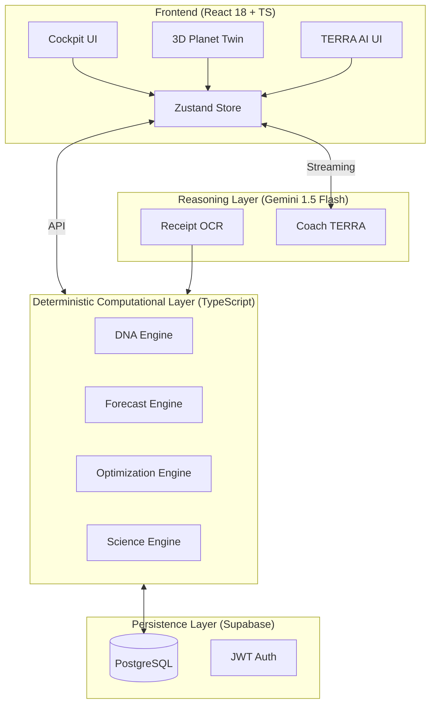

# CarbonSense

### AI-Powered Carbon Footprint Awareness Platform

**CarbonSense transforms carbon tracking into actionable sustainability intelligence through behavioral analysis, forecasting, optimization, and AI-powered guidance.**

[**Live Demo**](https://carbonsense.vercel.app/demo) | [**GitHub Repository**](https://github.com/anchit-sharma/carbonsense) | [**Challenge Info**](#challenge-3--carbon-footprint-awareness-platform)

---

## Challenge 3 – Carbon Footprint Awareness Platform

CarbonSense is purpose-built to solve the **Carbon Footprint Awareness** challenge by providing a unified intelligence cockpit where users can:

1.  **Measure**: Capture emissions data via high-fidelity Receipt Intelligence and manual logs.
2.  **Understand**: Analyze behavioral "DNA" to identify the psychological and lifestyle drivers of emissions.
3.  **Forecast**: Project current behavior into future planetary outcomes using AI-powered trajectory engines.
4.  **Reduce**: Implement prioritized, low-friction optimization roadmaps built on scientific MCDA models.
5.  **Track**: Monitor real-time progress toward sustainable targets and global benchmarks.

---

## Problem Statement

**The Awareness Gap**: Traditional carbon calculators treat footprints as passive accounting. They show *what* happened but fail to explain *why*, what the *consequences* are, or how to *change* effectively.

**The CarbonSense Solution**: We shift carbon tracking from static lists to **Situational Awareness**. CarbonSense explains the *reasoning* behind your footprint, visualizes the *future impact* on a personal Planet Twin, and provides a *coach* (TERRA) to guide behavioral change.

---

## Key Features (Awareness Engines)

### 1. Carbon Awareness Layer
**Purpose**: Immediate situational awareness.
Surfaces annual CO₂ footprint, global benchmark comparisons (vs 4.7t avg), and sustainable goal gaps (vs 2.0t target). It translates abstract KG into "Trees Required" or "KM Driven" to make impact tangible.

### 2. Carbon DNA Profiling
**Purpose**: Behavioral driver awareness.
Identifies the user's consumption "genome" (e.g., *Transport Dominant*, *Balanced Optimizer*). It measures volatility, intensity, and optimization readiness to explain *how* a user lives, not just what they emit.

### 3. Planet Twin Simulation (3D)
**Purpose**: Consequence awareness.
A real-time 3D simulation of Earth that morphs based on the user's footprint. It visualizes the "Earth Overshoot Index," showing how many planets would be required if humanity shared the user's lifestyle.

### 4. TERRA AI Coach
**Purpose**: Guidance awareness.
A Tactical Ecological Response & Reduction Advisor that uses Gemini 1.5 Flash to synthesize DNA, trends, and forecasts into a daily "Executive Brief." It provides evidence-based coaching to reduce carbon friction.

### 5. Receipt Intelligence
**Purpose**: Consumption awareness.
Uses AI to parse raw grocery and shopping receipts, instantly identifying the carbon intensity of specific items and eliminating the friction of manual data entry.

### 6. Optimization Engine (MCDA)
**Purpose**: Reduction pathway awareness.
Uses Multi-Criteria Decision Analysis to rank interventions by balancing carbon savings against habit difficulty and behavioral resistance.

### 7. Forecast Engine
**Purpose**: Predictive awareness.
Calculates 30/90/365-day trajectories. It identifies "Risk Drivers" (habits threatening goals) and visualizes the "Divergence" between current momentum and optimized paths.

---

## Carbon Awareness Methodology

CarbonSense guides users through a structured awareness lifecycle:

**Measure** (Receipts/Logs) → **Understand** (Carbon DNA) → **Forecast** (Planet Twin) → **Reduce** (Optimization Plan) → **Track** (Dashboard Telemetry)

---

## Architecture

Built as a high-performance modular monorepo ensuring mathematical integrity and AI reasoning are strictly separated.

*   **Frontend**: React, TypeScript, Zustand, Tailwind, React Three Fiber (3D).
*   **Backend**: Node.js (Express), Supabase (Auth/DB/Realtime).
*   **AI**: Google Gemini 1.5 Flash API (Strictly for reasoning/OCR).
*   **Deployment**: Vercel.

---

## Security & Reliability

*   **Key Isolation**: AI keys and Service Roles are strictly backend-only.
*   **JWT Validation**: Every request is verified via Supabase Auth middleware.
*   **Deterministic Accuracy**: All carbon math is calculated by TS engines, NOT by the AI, preventing hallucinations.
*   **Demo Sandbox**: The `/demo` mode is completely isolated in client memory using `demoData.ts`, ensuring zero production database risk.

---

## Accessibility (WCAG 2.1)

*   **Keyboard Navigation**: Full tab-index support for dashboard cockpit.
*   **Screen Reader Support**: ARIA roles and `aria-valuetext` for all charts/progress bars.
*   **Semantic HTML**: Proper use of regions and headings for structural clarity.
*   **Color-Independent**: Information is conveyed via icons and text, not just status colors.

---

## Testing & Validation

*   **Unit Tests**: **258 passing tests** across 7 computational packages.
*   **Validation**: Zod schemas for every API input/output.
*   **Coverage**: High-density coverage for Carbon Science, DNA, and Forecast math.

---

## Impact & Measurable Outcomes

*   **Transparency**: Users see their annual footprint vs. the sustainable 2.0t limit within 3 seconds of login.
*   **Reduction**: The Optimization Engine identifies immediate savings of up to 40% through prioritized behavioral shifts.
*   **Awareness**: "Impact Translation" converts kg CO₂ into "Trees to Plant" and "Days of Home Energy."

---

## Explore Demo (Evaluator Guide)

Judges can access the application instantly: [**CarbonSense Demo**](https://carbonsense.vercel.app/demo)

*   **No Registration Required**: Instant access via pre-seeded sandbox.
*   **Safe Environment**: No database mutations; resets on refresh.
*   **What to Test**:
    1.  **Dashboard**: View the **Carbon Awareness Layer** hero section.
    2.  **Coach**: Chat with **TERRA** about your reduction plan.
    3.  **Planet Twin**: Explore the 3D globe and toggle trajectories.
    4.  **DNA**: Review your behavioral archetype report.

---

## Why CarbonSense Is Different

Most trackers tell you **what happened**. CarbonSense helps you understand **why it matters** and **what happens next**. It is not just a calculator; it is a **situational awareness system** for the planet.

---

## Final Evaluation Mapping

| Evaluation Criteria | CarbonSense Feature Mapping |
| :--- | :--- |
| **Carbon Awareness** | Carbon Awareness Layer + Impact Translation |
| **Behavior Change** | Carbon DNA Profiling + TERRA AI Coaching |
| **Forecasting** | Forecast Engine + Planet Twin Trajectories |
| **Reduction Planning** | Optimization Engine (MCDA Ranking) |
| **Tracking** | Dashboard Cockpit + Real-time Telemetry |
| **Engineering Quality** | 258 Tests + Modular Monorepo + Strict TS |
